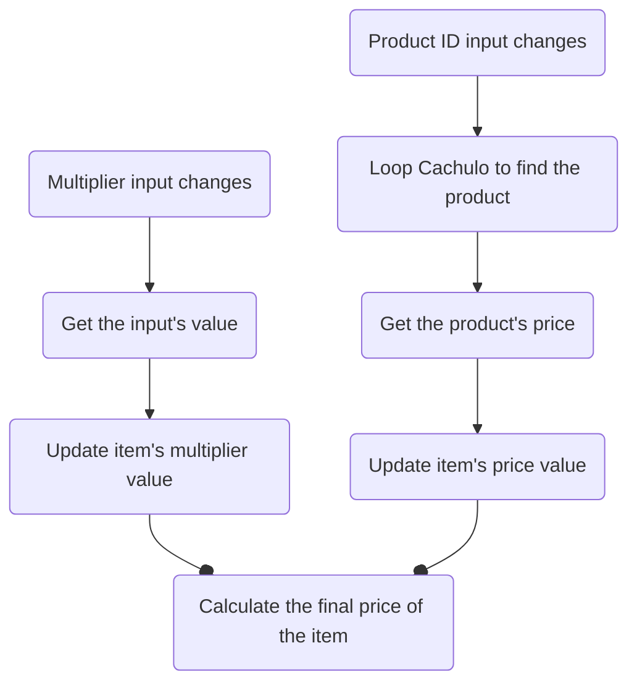

This note is here *not* for documentation purposes, but instead to organize my head a little bit and wrap up the logic behind updating an item's price.

The update trickles down with the following logic:

This note will focus on the relationship between the inputs and the item's price.

## The Calculated Price
Its a simple multiplication, but with data that takes some steps to get to.
$$
cp = pppum * multiplier
$$
Where: 
- **cp** means 'calculated price';
- **pppum** stands for _Product's Price Per Unit Of Measurement_ - The unit of measurement depends on the product, and can be a single product unit (_Acessórios_), per meter (_Alumínios_), or per meter squared (_Vidros_)
- **multiplier** is the unit of measurement's measure. So it could be an integer meaning quantity, or a float meaning an area or a lenght. It just multiplies the pppum for a measure of some kind.

## The Challenge

The two incognitas of the formula come from two different inputs, and while the multiplier is fairly easy to pass through a function's argument, the price of an item is not as linear.

But first, lets see what the function that calculates the price needs to do:

Furthermore, the price needs more information to be retrieved than the multiplier
Information needed to get a value:
- Multiplier: 
    - Just the input's value
- Price: 
    - The input's value (which is the Product's ID)
    - The item type (to cycle through the correct array: aluminios | vidros | acessorios )

 
