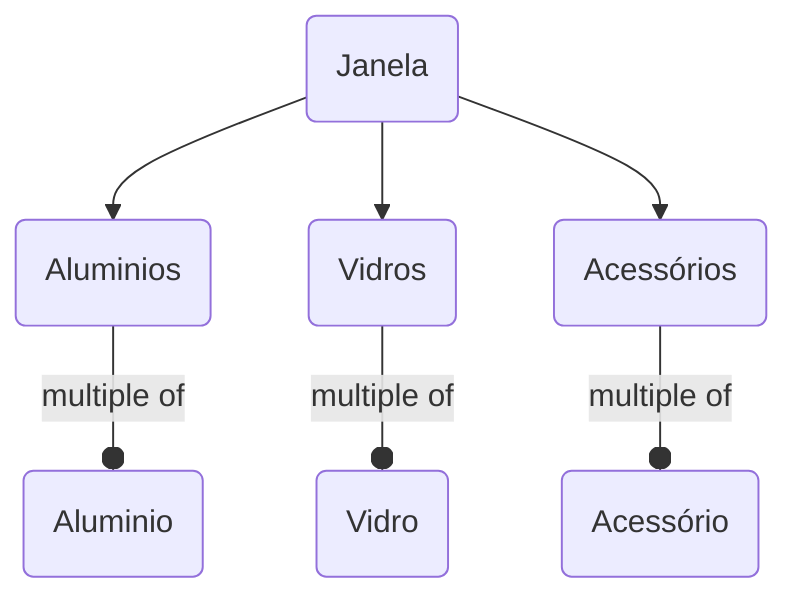

Cachulo has a very defined hierarchy when it comes to its grouping. It goes as follows:

```mermaid
flowchart TB;
    ja1(Janela) --> als(Aluminios)
    ja1 --> vis(Vidros)
    ja1 --> acs(Acessórios)
    als -- multiple of --o al(Aluminio)
    vis -- multiple of --o vi(Vidro)
    acs -- multiple of --o ac(Acessório)
```